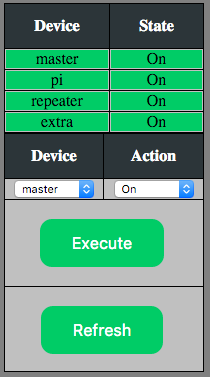
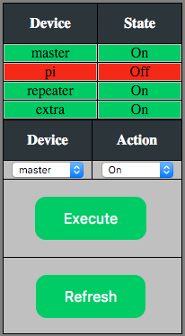

# raspi_power
This project spawned from my need to be able to remotely control decent sized loads to be able to power cycle equipment for an amateur radio repeater buildout.  This makes use of a Rasberry Pi's GPIO pins and an external relay board.  This code is simply a quick UI that I wrote up to control the GPIOs through a webserver.  You will want to add auth - it's on my to-do list but since I don't have any other base code I didn't want to add it just yet.

## Requirements
* [pigpio daemon](http://abyz.co.uk/rpi/pigpio/)
* Python
* Webserver
    - CGI enabled to handle Python
* [GPIO to Relay setup](http://enhanced.github.io/2016/02/Rasberry_Pi_Power_Control_PT1)
    - [Revision](http://enhanced.github.io/2016/02/Rasberry_Pi_Power_Control_PT1_5)

## What you need to do
1. You will need to clone this repository
2. Allow the wevserver context to execute the python code 
3. Modify the relay_pins table to match however you wired it up
4. Good Luck 

I'll have as much as I can posted at http://enhanced.github.io in terms of directions and how my actual setup looks

## What it looks like

Power On:

Power Off:

